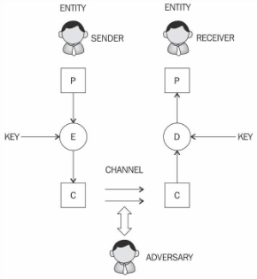
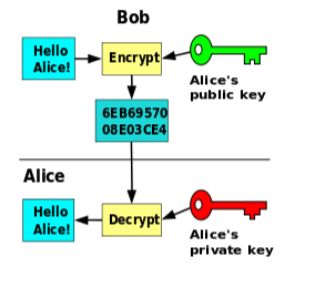
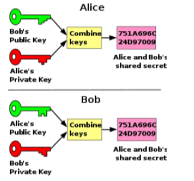

# Cryptography

Author: André Zandee
Created: 3 Sept 2018

Cryptography is the science of making information secure. It facilitates secure communication.

Ciphers (keys) are used to encrypt (and decrypt) data so that if intercepted by an adversary the data is meaningless to them without decryption which requires this secret key.

In the context of Blockchain, cryptography provides various security services such as 

*   Confidentiality 			(selective transparency)
*   Integrity			(knowing for sure no one manipulated the message)
*   authentication 			(both for entity and data origin) and 
*   non-repudiation		(security that every message is included / cannot denied).

Important system functionalities in a system using cryptography (such as Blockchain) are:

1.  Key establishment (how are the keys being created ? and distributed ?)
1.  Digital signatures (how does the user sign a blockchain transaction ?)
1.  Identification (how does the system uniquely identify a user ? (KYC))
1.  Encryption process and (what is the used encryption protocol ?and what is the used encryption process ?)
1.  Decryption process (see encryption)

This document is currently intended to give a high level overview of this topic, so for now it would dig too deep to go into above topics 1-3. Below a high-level explanation of 4 & 5.

<table>
  <tr>
   <td style="width: 65%"><strong>Encryption & Decryption process</strong>

A typical schema to show how an encryption / decryption process functions, shown visually 👉

A sender creates a message (P), sender encrypts it using the (private) key. The encrypted message (C) is transferred (i.e. by email or through internet) to the receiver. The receiver has got a matching key and decrypts the message, returning the message to it's original content and form (P).
   </td>
   <td>
		
   </td>
  </tr>
</table>

High over, there are 2 ways of encryption: Symmetric and A-symmetric.

1.  **Symmetric cryptography**: a type of cryptography whereby the _key to encrypt_ the _message is the same_ as the _key to decrypt_ the message.
1.  **Asymmetric cryptography**: a type of cryptography whereby the _key_ that is used _to encrypt_ the data _is different_ from the _key to decrypt_ it.

In Blockchain typically the 2nd is used, whereby an individual uses a Private (secret) and a Public key. To make a normal-day-comparison: 

*   Public key is usually publicly known (can be compared with a Bank Account Number (+ Name)
*   Private key is only known to the owner (can be compared with the bank-card + pincode)

The Private and Public keys are methematically linked (private key is created, public key is mathematically derived from it (usually through a hash-function – explanation hash-function: see below)).

## Transaction encryption process

A transaction is defined (based on a smart contract), and either needs a single signature to be committed (think i.e. of a donation) or multiple (think of a sale of an item). 

<table>
  <tr>
   <td>
	
   </td>
   <td>
	
   </td>
  </tr>
  <tr>
   <td>Single signature blockchain transaction
   </td>
   <td>Double signature blockchain transaction
   </td>
  </tr>
</table>

So now the transaction is secured, but how does it securely end up in the blockchain ?

## Hash Function

A hash-function is calculated based on an algorithm and used to create a fixed length "summary" of a text / message. This "summary" is made before some processing steps (such as send an email or a transaction). After the message has gone through the processes, the same "summary" is made again by the receiver, and the "before" and "after" hashes are compared. 

If there is a difference, either the message did not arrive complete or has been manipulated. 

What makes a hash different from above explained encryption, is that a hash does not have a decryption – in other words, the hash-outcome cannot be calculated back to its original message.

In blockchain this hash-function is being used to 1) link transactions into blocks and 2) blocks into the block-chain in such a way, that no one can de-commit already committed transactions, or get rid of a block.

A common-used hash-function in blockchains is SHA-256 (which means it is a 256-bit / 32 character  output). Lower number of characters are supposed to be too easy to hack.

## Protocols, Encryption algorithms requirements

The topic of encryption and hashing is highly mathematical very complex and going in-depth here exceeds the current target of this document.

If you want to read further and go in-depth, please take a look at the examples in the table below:

<table>
  <tr>
   <td><strong>Cryptography Category</strong>
   </td>
   <td><strong>Types</strong>
   </td>
   <td><strong>Examples</strong>
   </td>
  </tr>
  <tr>
   <td rowspan="3" >Symmetric Cryptography (encryption key = decryption key)
   </td>
   <td rowspan="2" >Stream Ciphers
   </td>
   <td>Synchronous key stream (dependency only on the key)
   </td>
  </tr>
  <tr>
   <td>Asynchronous key stream (dependency on the key  + on encrypted data itself)
   </td>
  </tr>
  <tr>
   <td>Block Ciphers (algorithm what breaks up to-be-encrypted text into fixed-length blocks and then applies encryption)
   </td>
   <td>Example: AES (Rijndael) Fiestel ciphers, DES (Data Encryption Standard) AES (Advanced Encryption Standard)
   </td>
  </tr>
  <tr>
   <td>Asymmetric Cryptography (encryption key <> decryption key)
   </td>
   <td>Integer factorization

Discrete Logarithm

Elliptic Curves
   </td>
   <td>RSA, DSA, El-Gammal
   </td>
  </tr>
</table>

_Source: Mastering Blockchain (Imran Bashir 2017)_

<!-- GD2md-html version 1.0β11 -->
