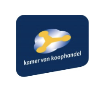
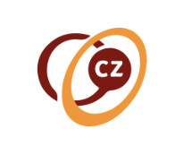

# Self-Sovereign Identity Framework (SSIF)

Together with partners from Techruption and the Dutch Blockchain Coalition like TNO, CZ, Rabobank, ABNAMRO, KvK is working on a framework that gives individuals control over their identity and enables organisations to effectively use identity information.  

## The Problem

Currently, individuals can’t effectively control or use their personal information on the internet. The other problem is that businesses don't have good mechanisms to verify identity claims.

## The Solution
Create an identity framework that:
* That enables individuals to create and control their digital identity. The identity framework is available for people, for organisations and for ‘things’. The Self-sovereign Identity can be used in electronic transactions with governments, businesses or other people.
* That enables organisations to specify and implement decentralised IT solutions (e.g. apps) for electronic business transactions and to create, control and use identities and personal information in a way similar to that of individuals.

## The Project

Involves:
* Conceptual model
* Technical infrastructure
* Identity Management solution on blockchain
* Governance model
* Real life implementations

## Status
We're currently working on two experiments:

1. KvK (Chamber of Commerce): build a process that makes it possible to
establish a firm online (including getting a KvK number, VAT number, bank
account, etc.).  

2. CZ (Health insurer): significantly improve declaration process of customers’
health expenses through the use of digital attestations. Experiment with issuing
“de pil”. Status: prototype being built. Preparing for a pilot to start in Jan. 2019.

## How to Help
?> Want to know more about self sovereign identity? [📄 Read this](https://blockchain.tno.nl/blog/self-sovereign-identities-it-is-going-to-happen/)    Want to know more about the project?
[✉️ Contact us](https://groeifabriek.com/#contact)
